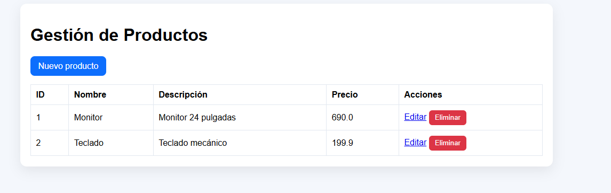
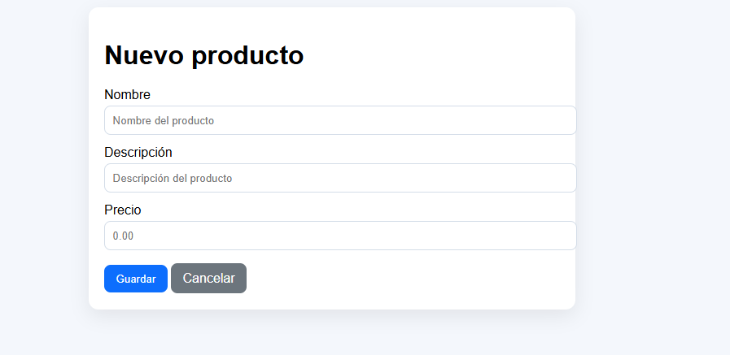
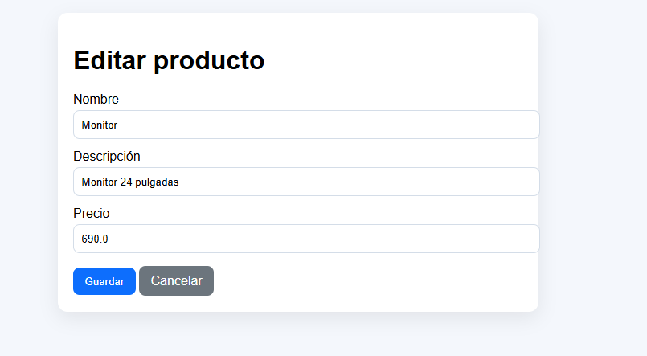
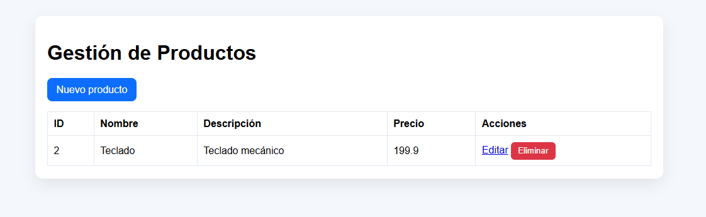
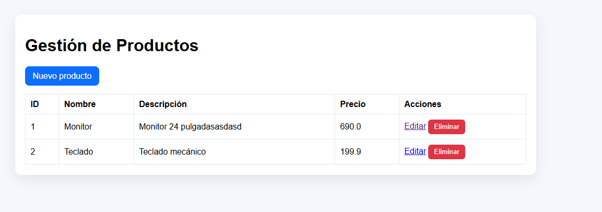

# Productos Web — Spring Boot + Docker + Railway

Aplicación CRUD de productos desarrollada con Spring Boot 3, Thymeleaf y PostgreSQL. Contenedorizada con Docker multi-stage y desplegada en Railway.

## Capturas de pantalla

| Vista | Captura |
|-------|---------|
| Pantalla de inicio |  |
| Nuevo producto |  |
| Editar producto |  |
| Eliminar producto |  |
| Cambios guardados |  |

## Construir la imagen Docker localmente

```bash
docker build -t productos-web:local .
```

## Ejecutar con Docker Compose

```bash
docker compose up -d --build
```

Esto levanta dos servicios:

| Servicio | Puerto | Descripción |
|----------|--------|-------------|
| `app`    | 8080   | Aplicación Spring Boot |
| `db`     | 5432   | PostgreSQL 16 Alpine |

Verificar que ambos contenedores estén saludables:

```bash
docker compose ps
```

Probar el health check:

```bash
curl http://localhost:8080/actuator/health
```

## Variables de entorno requeridas

| Variable         | Descripción                          | Ejemplo                                                   |
|------------------|--------------------------------------|-----------------------------------------------------------|
| `SPRING_PROFILES_ACTIVE` | Perfil activo de Spring Boot     | `prod`                                                    |
| `DATABASE_URL`   | URL de conexión a PostgreSQL         | `jdbc:postgresql://db:5432/appdb`                        |
| `DB_USER`        | Usuario de base de datos             | `appuser`                                                 |
| `DB_PASS`        | Contraseña de base de datos          | `apppass`                                                 |

## Despliegue en Railway

1. Ir a [railway.app](https://railway.app) e iniciar sesión con GitHub.
2. Crear proyecto → **Deploy from GitHub repo** → seleccionar el repositorio.
3. Railway detecta el `Dockerfile` automáticamente y construye la imagen.
4. Agregar una base de datos: **+ New → Database → Add PostgreSQL**.
5. En el servicio de la app, ir a **Variables** y agregar:
   - `SPRING_PROFILES_ACTIVE = prod`
   - `DATABASE_URL = ${{Postgres.DATABASE_URL}}`
   - `DB_USER = ${{Postgres.PGUSER}}`
   - `DB_PASS = ${{Postgres.PGPASSWORD}}`
6. Generar dominio público: **Settings → Networking → Generate Domain**.

### Verificar el despliegue

```bash
curl https://mi-app.up.railway.app/actuator/health
curl https://mi-app.up.railway.app/api/productos
```

## Endpoints REST

| Método | Ruta                  | Descripción            |
|--------|------------------------|------------------------|
| GET    | `/api/productos`       | Listar productos       |
| GET    | `/api/productos/{id}`  | Obtener producto por ID|
| POST   | `/api/productos`       | Crear producto         |
| PUT    | `/api/productos/{id}`  | Actualizar producto    |
| DELETE | `/api/productos/{id}`  | Eliminar producto      |
| GET    | `/actuator/health`     | Health check           |

## Endpoints MVC (Thymeleaf)

| Ruta                    | Descripción                    |
|-------------------------|--------------------------------|
| `/productos`            | Lista de productos (HTML)      |
| `/productos/nuevo`      | Formulario de nuevo producto   |
| `/productos/editar/{id}`| Formulario de edición          |
| `/productos/guardar`    | Guardar producto (POST)        |
| `/productos/eliminar/{id}` | Eliminar producto (POST)    |

## Estructura del proyecto

```
├── Dockerfile
├── .dockerignore
├── docker-compose.yml
├── pom.xml
├── src/main/java/com/universidad/productosweb/
│   ├── ProductosWebApplication.java
│   ├── controller/
│   │   ├── HomeController.java
│   │   ├── ProductoController.java
│   │   └── ProductoRestController.java
│   ├── model/
│   │   └── Producto.java
│   ├── repository/
│   │   └── ProductoRepository.java
│   └── service/
│       └── ProductoService.java
└── src/main/resources/
    ├── application.properties
    ├── application-prod.properties
    └── templates/productos/
        ├── lista.html
        └── formulario.html
```
